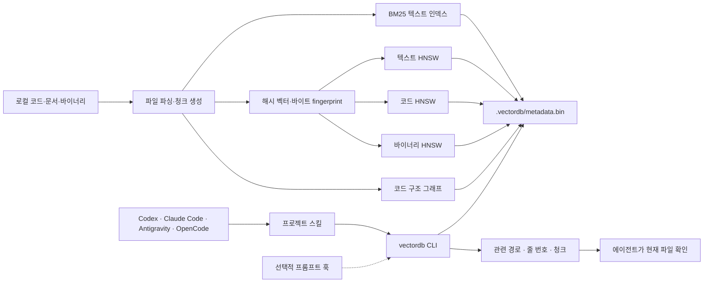

# VectorDB

VectorDB는 로컬 파일과 코드에서 **작업에 관련된 위치를 찾는 실험용 인덱스**입니다. Rust CLI 하나로 파일을 색인하고, 검색 결과를 경로·줄 번호·청크로 받아 에이전트의 탐색에 사용할 수 있습니다. [Antigravity](#에이전트에-연결하기), [Claude Code](#에이전트에-연결하기), [Codex](#에이전트에-연결하기), [OpenCode](#에이전트에-연결하기)용 프로젝트 스킬을 제공합니다. Codex와 Claude Code에는 선택적으로 프롬프트 훅을 연결할 수 있습니다.

> 현재는 품질과 규모를 검증하는 단계입니다. 기본 벡터는 신경망 임베딩이 아니라 토큰·문자 n-gram 해시입니다. 측정값과 미검증 범위는 [REPORT.md](REPORT.md), [VALIDATION.md](VALIDATION.md)에 있습니다.

## 어떻게 작동하나요?



색인은 로컬 스냅샷으로 저장됩니다. 에이전트 스킬은 필요할 때 CLI를 호출하고, Codex·Claude Code의 선택적 훅은 프롬프트마다 짧은 경로 힌트를 제공합니다. 훅이 파일을 색인하거나 에이전트 대신 코드를 수정하지는 않습니다.

## 빠른 시작

Rust 도구 모음을 설치한 뒤 이 저장소에서 CLI를 빌드합니다.

```bash
cargo install --path crates/vectordb-cli --locked
```

검색할 프로젝트에서 첫 스냅샷을 만듭니다. 아래의 `PROJECT`는 원하는 프로젝트의 **절대 경로**로 바꾸세요.

```bash
PROJECT=/absolute/path/to/your/project
cd "$PROJECT"
vectordb index .
vectordb search "authentication token refresh" --format json --limit 5
```

기본 저장 위치는 프로젝트의 `.vectordb/`입니다. `--db-dir /absolute/path/to/.vectordb`로 다른 위치를 지정할 수 있습니다. `index`는 대상 디렉터리를 스캔하고 기존 파일의 청크를 교체합니다. 계속 바뀌는 파일을 반영하려면 별도 터미널에서 `vectordb watch .`를 실행하세요. 감시를 중단해도 마지막 저장 스냅샷으로 검색할 수 있습니다.

### 검색 결과 사용 예

```bash
vectordb search "HNSW snapshot loading" --limit 5 --format json
vectordb find HnswIndex
vectordb chunk '<search-result chunk.id>'
vectordb graph '<search-result node.id>' --hops 1
vectordb impact HnswIndex --depth 2
vectordb context "persist an index without rebuilding it"
vectordb status
```

`search --format json`은 `hits` 배열을 반환하며 각 항목에 `chunk.id`, `chunk.file_path`, `chunk.start_line`, `chunk.end_line`, 점수와 연결 노드가 들어 있습니다. `chunk`와 `graph`에는 실제 검색 결과에서 받은 ID를 사용하세요. 색인된 청크는 작업 중 바뀔 수 있으므로 에이전트는 편집 전에 현재 파일을 다시 열어 확인해야 합니다.

## 에이전트에 연결하기

MCP 서버나 상주 데몬은 필요하지 않습니다. **하나의 `SKILL.md`와 CLI**를 사용합니다. 설치기는 다른 프로젝트에도 스킬을 복사하고, Claude Code가 읽는 위치를 함께 연결합니다. 설치기와 선택 훅에는 Python 3.10 이상이 필요합니다.

```bash
# VectorDB 저장소에서 실행. PROJECT는 위에서 지정한 대상 프로젝트입니다.
python3 integrations/install.py "$PROJECT"
```

| 에이전트 | 프로젝트에서 읽는 스킬 | 사용 방법 |
|---|---|---|
| Codex | `.agents/skills/vectordb-search/SKILL.md` | 관련 파일 탐색을 요청하거나 `$vectordb-search` 사용 |
| Antigravity | `.agents/skills/vectordb-search/SKILL.md` | 관련 파일 탐색 요청, 필요하면 스킬을 명시 |
| OpenCode | `.agents/skills/vectordb-search/SKILL.md` | 관련 파일 탐색 요청, 필요하면 스킬 도구로 로드 |
| Claude Code | `.claude/skills/vectordb-search/SKILL.md` | 관련 파일 탐색 요청 또는 `/vectordb-search` 사용 |

이 배치는 [Codex의 저장소 스킬 경로](https://learn.chatgpt.com/docs/build-skills), [Antigravity의 프로젝트 스킬 경로](https://codelabs.developers.google.com/getting-started-google-antigravity), [OpenCode의 스킬 검색 경로](https://opencode.ai/docs/skills), [Claude Code의 프로젝트 스킬 경로](https://code.claude.com/docs/en/skills)에 맞춥니다. 이 저장소 자체에도 동일한 스킬이 포함되어 있습니다.

에이전트에게 다음처럼 요청할 수 있습니다.

> VectorDB 스킬로 로그인 만료 처리 코드를 찾아줘. 관련 경로와 줄 번호를 알려주고, 실제 파일을 확인한 다음 수정해줘.

### 실사용 시나리오 1: 버그 수정 위치 찾기

예를 들어 다른 저장소에서 “토큰 갱신 후에도 로그인이 풀린다”는 이슈를 받았다면:

1. 프로젝트에서 `vectordb index .`를 한 번 실행하고 위 설치기로 스킬을 넣습니다.
2. 에이전트에게 **“VectorDB로 토큰 갱신·세션 만료 코드를 찾아 관련 파일을 확인해줘”**라고 요청합니다.
3. 에이전트는 `search`로 후보 경로를 받고, `find`로 관련 심볼을 좁힌 뒤, 현재 파일을 열어 실제 구현을 확인합니다. 수정 영향이 궁금하면 `impact`를 조회합니다.
4. 에이전트가 코드를 바꾼 뒤에는 `vectordb index .`를 다시 실행하거나 `watch`가 변경을 저장할 때까지 기다린 다음 검색 결과를 재확인합니다.

이 순서는 인덱스를 **탐색 출발점**으로 쓰는 예입니다. 검색 점수만으로 버그 위치나 수정의 안전성이 확정되지는 않습니다.

### 실사용 시나리오 2: 작업 중 계속 바뀌는 저장소

첫 색인을 만든 뒤 별도 터미널에서 감시를 켭니다.

```bash
cd "$PROJECT"
vectordb watch . --debounce-ms 300
```

에이전트가 파일을 저장하면 감시기가 파일 시스템 이벤트를 묶어 바뀐 경로를 다시 색인합니다. 다음 검색은 저장된 새 스냅샷을 읽습니다. 감시 시작 전에 첫 색인을 수행해야 하며, 대규모 저장소에서는 변경 시 HNSW 재구축과 전체 스냅샷 쓰기 비용이 발생합니다.

### 선택 사항: 프롬프트 훅

Codex와 Claude Code에서는 사용자가 프롬프트를 보낼 때 로컬 인덱스를 조회해 **상위 세 경로와 줄 번호만** 에이전트 문맥에 넣는 훅을 켤 수 있습니다. 전체 청크나 파일 내용은 자동 주입하지 않습니다. 매 프롬프트마다 CLI 검색이 한 번 실행되므로 큰 인덱스에서는 시작 지연이 늘어납니다.

```bash
python3 integrations/install.py "$PROJECT" --hooks both
# 한쪽만 사용하면 --hooks codex 또는 --hooks claude
```

설치기는 기존 설정을 보존하고 `UserPromptSubmit` 항목 하나를 추가합니다. Codex의 [훅 검토 화면](https://learn.chatgpt.com/docs/hooks)에서 실행을 신뢰해야 하며, Claude Code도 [프로젝트 훅 설정](https://code.claude.com/docs/en/hooks)을 검토해야 합니다. 훅은 인덱스를 만들거나 갱신하지 않습니다. 색인이 없거나 CLI를 찾지 못하면 조용히 건너뜁니다. 에이전트가 프로젝트 하위 폴더에서 시작해도 가까운 상위 `.vectordb`를 찾습니다. 사용자 지정 위치는 `VECTORDB_DB_DIR`, CLI 위치는 `VECTORDB_BIN` 환경 변수로 지정할 수 있습니다.

Antigravity와 OpenCode는 위 스킬로 연결됩니다. 이 저장소는 두 제품의 자동 훅 설정을 설치하지 않습니다. 파일 최신화가 필요하면 `vectordb watch .`를 실행하세요.

### 연결 확인과 문제 해결

1. 대상 프로젝트에서 `vectordb status`로 인덱스가 있는지 확인합니다. 없으면 `vectordb index .`를 실행합니다.
2. 새 에이전트 대화를 시작하고 “VectorDB 스킬로 관련 파일을 찾아줘”라고 요청합니다. Claude Code는 `/vectordb-search`, Codex는 `$vectordb-search`로 명시할 수도 있습니다.
3. 훅을 켰다면 다음 입력으로 경로가 출력되는지 직접 확인합니다. 실제 제품 안에서 훅이 실행되는지는 각 제품의 훅 상태 화면이나 로그에서 따로 확인해야 합니다.

```bash
printf '%s\n' '{"cwd":"/absolute/path/to/your/project","prompt":"find authentication token refresh code"}' \
  | python3 "$PROJECT/.agents/vectordb/prompt_hook.py"
```

`vectordb: command not found`이면 Cargo의 바이너리 디렉터리(보통 `~/.cargo/bin`)를 `PATH`에 넣거나 훅에 `VECTORDB_BIN`을 지정하세요. 빈 훅 출력은 인덱스·실행 파일·검색 결과가 없을 때 정상입니다. 프로젝트를 이동했다면 Codex 훅에 저장된 스크립트 절대 경로를 갱신하도록 설치기를 다시 실행하세요.

## 현재 제공하는 검색

- **하이브리드 검색:** BM25와 텍스트·코드별 HNSW 결과를 순위 기반 RRF로 합칩니다. 기본 벡터는 lexical feature hashing입니다.
- **코드 구조:** 파일·함수·타입 등의 노드와 `Contains`, `Defines`, `NextChunk` 관계를 기록합니다. 이름 패턴으로 추정한 호출은 `CallsCandidate`로 표시하며 확정된 호출로 취급하지 않습니다.
- **파일 형식:** 코드, Markdown·텍스트, 일부 PDF·오디오 메타데이터·이미지·바이너리를 처리합니다. 자체 파서의 형식별 정확도는 아직 제한적입니다.
- **바이너리 유사도:** byte fingerprint는 별도 공간에 저장하고 `vectordb similar-binary <상대 경로>`에서만 비교합니다.
- **저장과 감시:** VDB3 스냅샷은 HNSW 그래프를 저장합니다. 파일 시스템 이벤트를 모아 바뀐 경로를 재색인합니다. 이전 VDB2는 로드 후 다음 저장 때 VDB3로 갱신됩니다.
- **웹 API:** `vectordb serve --port 8080`으로 로컬 웹 화면과 REST API를 실행할 수 있습니다.

## 한계와 운영 메모

| 항목 | 현재 상태 |
|---|---|
| 첫 검색 | 10만 합성 벡터에서 별도 CLI 프로세스 첫 검색 p50 약 569ms. 파일 시스템 캐시가 따뜻한 다섯 번의 측정입니다. |
| 수정 비용 | 파일 변경 시 영향을 받은 HNSW 공간을 재구축하고 전체 스냅샷을 다시 씁니다. 대규모 코퍼스의 지속적 변경에는 부담이 큽니다. |
| 검색 품질 | 포함된 라벨 fixture는 14개 문서·12개 질문의 기능 점검입니다. 실제 에이전트 작업 성능의 근거로 삼을 수 없습니다. |
| 최신성 | 에이전트 훅은 읽기 전용입니다. 변경 반영에는 재색인이나 `watch`가 필요합니다. |
| 접근 범위 | 프로젝트에서 색인한 로컬 파일을 CLI가 읽습니다. 민감한 파일이 있는 디렉터리는 색인 범위를 직접 선택하세요. |

전체 측정 조건과 다음 검증 과제는 [REPORT.md](REPORT.md)에 정리했습니다.

## 개발과 검증

```bash
cargo test
cargo test incremental_matches_fresh_after_ten_thousand_mutations -- --ignored
cargo clippy --workspace --all-targets -- -D warnings
python3 -m unittest discover -s integrations -p 'test_*.py'
cargo run --release -p vectordb-cli -- benchmark benchmarks/retrieval-smoke.json
cargo run --release -p vectordb-cli -- ann-benchmark --vectors 10000 --queries 50 --ef-search 256
cargo run --release -p vectordb-cli -- cold-benchmark --vectors 100000 --iterations 5
```

| 경로 | 역할 |
|---|---|
| `crates/vectordb-core` | BM25, 벡터 인덱스, 그래프, 저장, 검색 |
| `crates/vectordb-parser` | 코드·파일 파싱, Git 이력 관계 |
| `crates/vectordb-cli` | CLI, 벤치마크, 파일 감시 |
| `crates/vectordb-server` | 로컬 REST API와 웹 화면 |
| `.agents/skills/vectordb-search` | 에이전트용 검색 스킬 |
| `integrations` | 다른 프로젝트에 스킬·선택 훅 설치 |

라이선스: MIT 또는 Apache-2.0.
